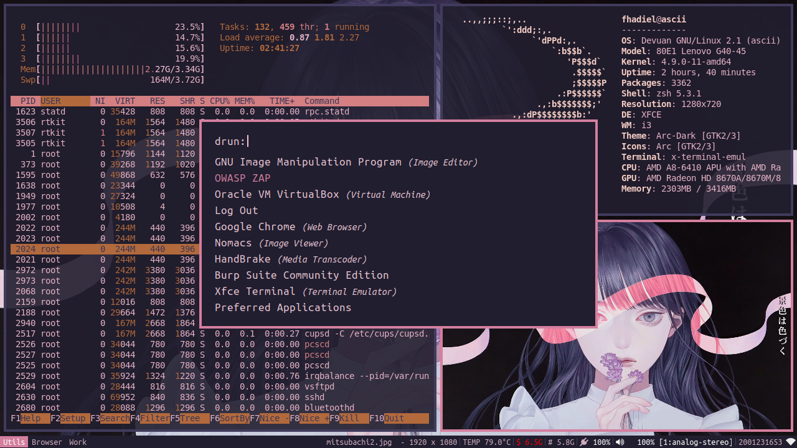

# Shiny Days Color Schemes  
[coolors.co](https://coolors.co/7fccd9-f0a161-f0df44-ef798a-9297c4)

.Xresources

! special
*.foreground:   #e1e2ee
*.background:   #1b1c24
*.cursorColor:  #e1e2ee

! black
*.color0:       #282a36
*.color8:       #373b41

! red
*.color1:       #ef798a
*.color9:       #f08594

! green
*.color2:       #7fccd9
*.color10:      #86f085

! yellow
*.color3:       #f0df44
*.color11:      #f1e359

! blue
*.color4:       #7fccd9
*.color12:      #a1d9e3

! magenta
*.color5:       #9297c4
*.color13:      #afb3d4

! cyan
*.color6:       #9297c4
*.color14:      #c2d4af

! white
*.color7:       #9297c4
*.color15:      #f1e7e9

